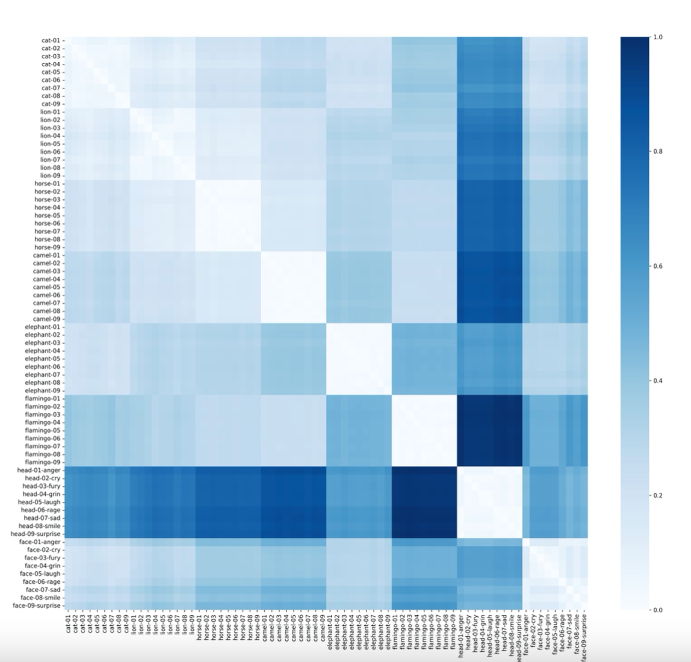
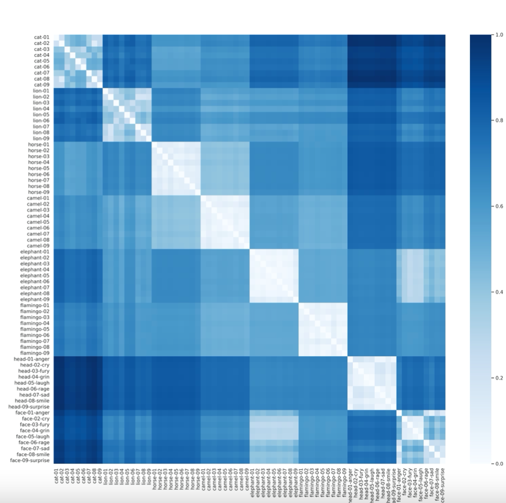

# Shape Comparison and Retrieval

- [Introduction](#Introduction)
- [An illustration](#Anillustration)

### Introduction

The goal of this project is to compare two kind of shape descriptors based on Laplace-Beltrami operator: one that uses its eigenvalues directly [Reuter et al. [2006]](https://www.sciencedirect.com/science/article/pii/S0010448505001867?casa_token=6WZmrhx65JkAAAAA:qLvGDoEdJRwp5RFEilGpQMOL6QKvC1GZQVHUT9DXAoPtZdytyAAvulRf1XDklEPKvJvtC0Ll9A) and the other which derives a deformation invariant representation of surfaces from its eigenvalues and eigenfunctions, namely the GPS embedding, introduced in [Rustamov [2007]](https://www.cs.jhu.edu/~misha/Fall07/Papers/Rustamov07.pdf). The difference between these two methods is that the shape DNA which is the set of Laplace-Beltrami eigenvalues – the spectrum – does not determine the surface uniquely up to isometry; there are so called isospectral shapes – non-isometric surfaces that have coinciding spectra. This flaw is overcame in [Rustamov [2007]](https://www.cs.jhu.edu/~misha/Fall07/Papers/Rustamov07.pdf).

Experiments are conducted over [Deformation Transfer for Triangle Meshes dataset](https://people.csail.mit.edu/sumner/research/deftransfer/).

### An illustration

*Distance matrix obtained for classification using Shape DNA embeddings.*

*Distance matrix obtained for classification using GPS embeddings and G2 distribution.*

GPS embeddings based method is more robust to inner class shape variations and also separates better different classes of shapes. It is also isometry invariant which is important for various problems in shape analysis.
